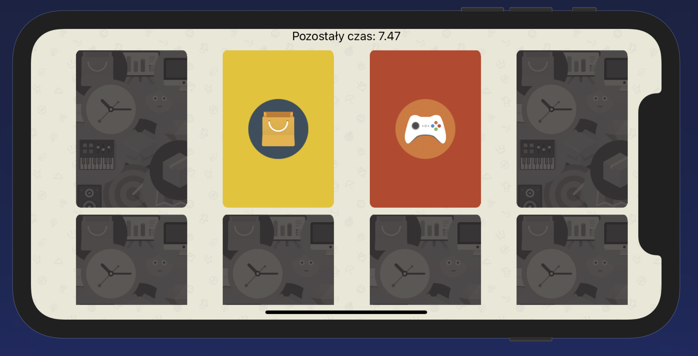
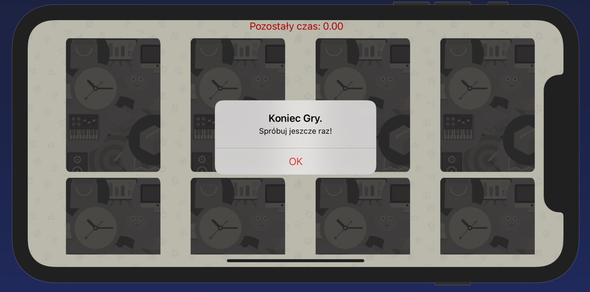

# MatchApp.
>  I had make app ispired by CodeWithChris Toutorial and lessons. 
Its a simlpe logic game based on popular matching Card Game. 

## Table of contents
* [General info](#general-info)
* [Screenshots](#screenshots)
* [Technologies](#technologies)
* [Setup](#setup)
* [Features](#features)
* [Status](#status)
* [Inspiration](#inspiration)
* [Contact](#contact)

## General info

In this project i had lerned how to implemented and use some elements and structures of Swift frameworks.
Foundation, UIKit, AVFoundation. I had lerned about MVC pattern, Protocol & Delegates comunicate pattern.
And foundamental storyboard app creations by Views. Add more general information about project. 

## Screenshots

## Technologies
* Tech 1 - version 1.0

## Setup
Import to Xcode and Simulate on your Device. 

## Code Examples
`nil-at-the-moment` :)

## Features
TODOs for future development:
* Game Level- Hardness Concept

## Status
Project is: _in progress

## Inspiration
Project based on CodeWithChris YT - Course. 
(https://www.youtube.com/playlist?list=PLMRqhzcHGw1ZkH8RuznGMS0NZs0jWQQ5a)

## Contact
Created by mail agaisab@gmail.com feel free to contact me!
